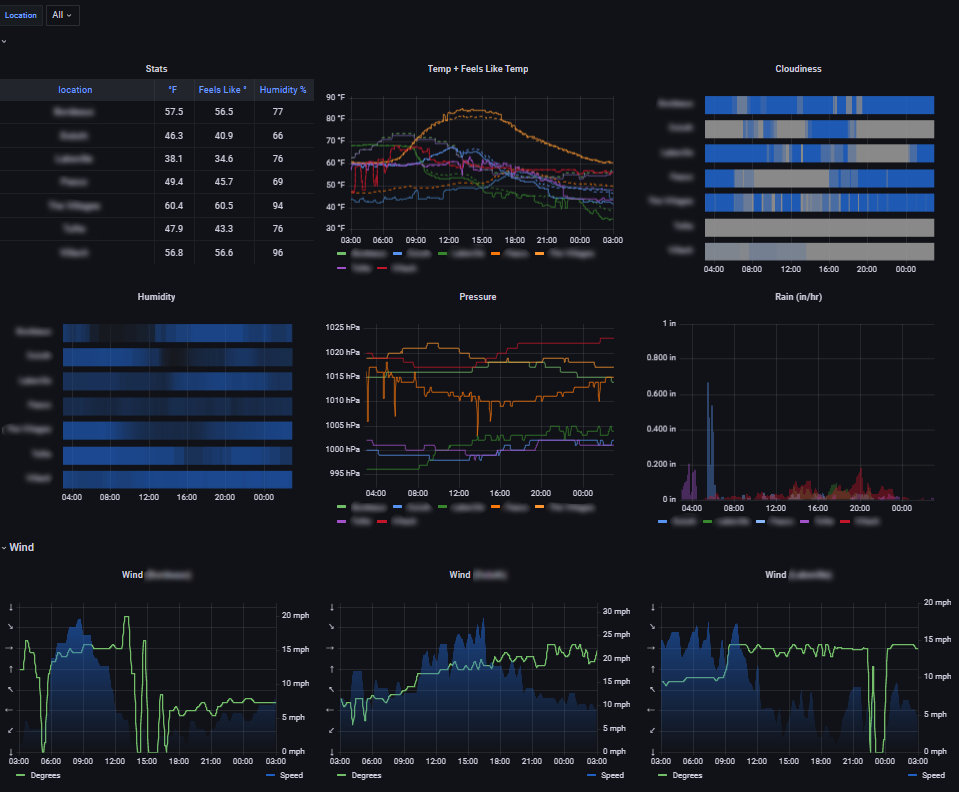

# OpenWeatherMap Exporter

The `openweathermap_exporter` is a prometheus exporter to query weather readings for many locations and publis their values in as metrics prometheus exposition format.

[docs.rs](https://docs.rs/openweathermap_exporter) | [crates.io](https://crates.io/crates/openweathermap_exporter)

This uses the related crate [openweathermap_client](#openweathermap_client) to query weather from the API.

### Installation

Currently, no binaries or container images are being built. The only way to install it (assuming you have rust [already installed](https://www.rust-lang.org/tools/install)) is via:

```
cargo install openweathermap_exporter
```

Automatic, building of

- release binaries (to be manually installed, cargo binstalled, or packaged)
- cross-platform container images

is in the works as are several [other features](https://github.com/evaneaston/openweathermap/issues).

### Get An API Key

To obtain an OpenWeatherMap API Key, see [this section](#getting-an-openweathermap-api-key).

### Create A Config File

Create a config file. Start with the the template below (also available in source [here](./exporter/owm_exporter-template.yaml) )
This file should be named `owm_exporter.yaml` and placed in the working directory from where you plan to run the exporter or in the user's home (`~/` ,  `%USERPROFILE%`) directory.

```yaml
#listen:
#  address: localhost  # Defaults to localhost.  Can be omitted and specified in the environment variable LISTEN_ADDRESS.
#  port: 9001          # Defaults to 9001.  Can be omitted and specified in the environment variable LISTEN_PORT.

owm:
  api_key:             # You must provide a an api key.  Can be omitted from this file and specified in the environment variable API_KEY.
#  units: metric       # metric is the default
#  language: en        # en is the default

# The exporter doesn't currently warn if the duration of all the calls exceeds the duration
# of `poll_interval_seconds`.  It's up to you to reconfigure so that all readings can be read
# withing the `poll_interval_seconds` timeframe.  This will probably be updated in a future
# release.

#poll_interval_seconds: 60
#max_calls_per_minute: 60

cities:
  - name: Bangkok
    country_code: TH
  - name: New York, NY
    country_code: US

coordinates:
  - lat: -0.829278
    lon: -90.982067
    display_name: The Galapagos

locations:
  - id: 3936456
```

### Run The Exporter

By default the exporter is pretty quiet. It uses [env_logger](https://crates.io/crates/env_logger) to control the log level.

When first using the exporter, consider running with `info` or `debug` level

```
RUST_LOG=info cargo run
```

Available log levels are `error`, `warn`, `info`, `debug`, `trace`.

### Verify Metrics Are Published

All metrics returned by the free v2.5 API will be exported for scraping. At the moment any route will suffice to load the metrics. If you have not changed the default listen options you can test the your running instance with:

```
curl http://localhost:9001/
```

### Metric Names

Because metric names [are encouraged](https://prometheus.io/docs/practices/naming/) to contain unit names:

> A metric name...
>
> - ...should have a suffix describing the unit

`openweathermap_exporter` metrics all include the unit of the measurement in their name and HELP text. If you change the setting for `owm.units` in your config file, the names of the metrics and their HELP text will change accordingly.

See [Example Of Metric Names](#example-of-metric-names) to see how they're named and what information is available in the labels.

### Example Dashboard

I don't have a generalized dashboard template ready yet. But will share one soon. This is what my weather dashboard looks like:



### Example Of Metric Names

This is a scrape using the [example template config file](./exporter/owm_exporter-template.yaml).

```rust
# HELP owm_cloudiness_percent % cloudiness
# TYPE owm_cloudiness_percent gauge
owm_cloudiness_percent{location="New York",q="New York, NY,US",reading_id="5128581",reading_lat="40.7143",reading_lon="-74.006",reading_name="New York"} 0
owm_cloudiness_percent{location="Lima",id="3936456",reading_id="3936456",reading_lat="-12.0432",reading_lon="-77.0282",reading_name="Lima"} 100
owm_cloudiness_percent{location="The Galapagos",lat="-0.829278",lon="-0.829278",display_name="The Galapagos",reading_id="6295630",reading_lat="-0.8293",reading_lon="-0.8293",reading_name="Globe"} 96
owm_cloudiness_percent{location="Bangkok",q="Bangkok,TH",reading_id="1609350",reading_lat="13.75",reading_lon="100.5167",reading_name="Bangkok"} 100

# HELP owm_temperature_degrees_celsius Temperature in °C
# TYPE owm_temperature_degrees_celsius gauge
owm_temperature_degrees_celsius{location="The Galapagos",lat="-0.829278",lon="-0.829278",display_name="The Galapagos",reading_id="6295630",reading_lat="-0.8293",reading_lon="-0.8293",reading_name="Globe"} 26.1
owm_temperature_degrees_celsius{location="Lima",id="3936456",reading_id="3936456",reading_lat="-12.0432",reading_lon="-77.0282",reading_name="Lima"} 18.28
owm_temperature_degrees_celsius{location="Bangkok",q="Bangkok,TH",reading_id="1609350",reading_lat="13.75",reading_lon="100.5167",reading_name="Bangkok"} 27.76
owm_temperature_degrees_celsius{location="New York",q="New York, NY,US",reading_id="5128581",reading_lat="40.7143",reading_lon="-74.006",reading_name="New York"} 16.02

# HELP owm_humidity_percent % Humidity
# TYPE owm_humidity_percent gauge
owm_humidity_percent{location="Bangkok",q="Bangkok,TH",reading_id="1609350",reading_lat="13.75",reading_lon="100.5167",reading_name="Bangkok"} 83
owm_humidity_percent{location="The Galapagos",lat="-0.829278",lon="-0.829278",display_name="The Galapagos",reading_id="6295630",reading_lat="-0.8293",reading_lon="-0.8293",reading_name="Globe"} 79
owm_humidity_percent{location="Lima",id="3936456",reading_id="3936456",reading_lat="-12.0432",reading_lon="-77.0282",reading_name="Lima"} 76
owm_humidity_percent{location="New York",q="New York, NY,US",reading_id="5128581",reading_lat="40.7143",reading_lon="-74.006",reading_name="New York"} 56

# HELP owm_temperature_feels_like_degrees_celsius Perceived temperature in °C
# TYPE owm_temperature_feels_like_degrees_celsius gauge
owm_temperature_feels_like_degrees_celsius{location="Lima",id="3936456",reading_id="3936456",reading_lat="-12.0432",reading_lon="-77.0282",reading_name="Lima"} 18.15
owm_temperature_feels_like_degrees_celsius{location="New York",q="New York, NY,US",reading_id="5128581",reading_lat="40.7143",reading_lon="-74.006",reading_name="New York"} 15.14
owm_temperature_feels_like_degrees_celsius{location="Bangkok",q="Bangkok,TH",reading_id="1609350",reading_lat="13.75",reading_lon="100.5167",reading_name="Bangkok"} 31.93
owm_temperature_feels_like_degrees_celsius{location="The Galapagos",lat="-0.829278",lon="-0.829278",display_name="The Galapagos",reading_id="6295630",reading_lat="-0.8293",reading_lon="-0.8293",reading_name="Globe"} 26.1

# HELP owm_wind_speed_meters_per_second Wind speed in meters/second
# TYPE owm_wind_speed_meters_per_second gauge
owm_wind_speed_meters_per_second{location="New York",q="New York, NY,US",reading_id="5128581",reading_lat="40.7143",reading_lon="-74.006",reading_name="New York"} 8.75
owm_wind_speed_meters_per_second{location="Bangkok",q="Bangkok,TH",reading_id="1609350",reading_lat="13.75",reading_lon="100.5167",reading_name="Bangkok"} 0.08
owm_wind_speed_meters_per_second{location="The Galapagos",lat="-0.829278",lon="-0.829278",display_name="The Galapagos",reading_id="6295630",reading_lat="-0.8293",reading_lon="-0.8293",reading_name="Globe"} 5.8
owm_wind_speed_meters_per_second{location="Lima",id="3936456",reading_id="3936456",reading_lat="-12.0432",reading_lon="-77.0282",reading_name="Lima"} 2.57

# HELP owm_visibility_meters Visibility in meters, 10000 max
# TYPE owm_visibility_meters gauge
owm_visibility_meters{location="Lima",id="3936456",reading_id="3936456",reading_lat="-12.0432",reading_lon="-77.0282",reading_name="Lima"} 10000
owm_visibility_meters{location="The Galapagos",lat="-0.829278",lon="-0.829278",display_name="The Galapagos",reading_id="6295630",reading_lat="-0.8293",reading_lon="-0.8293",reading_name="Globe"} 10000
owm_visibility_meters{location="New York",q="New York, NY,US",reading_id="5128581",reading_lat="40.7143",reading_lon="-74.006",reading_name="New York"} 10000
owm_visibility_meters{location="Bangkok",q="Bangkok,TH",reading_id="1609350",reading_lat="13.75",reading_lon="100.5167",reading_name="Bangkok"} 3882

# HELP owm_wind_direction_degrees Wind direction in degrees (0-360)
# TYPE owm_wind_direction_degrees gauge
owm_wind_direction_degrees{location="The Galapagos",lat="-0.829278",lon="-0.829278",display_name="The Galapagos",reading_id="6295630",reading_lat="-0.8293",reading_lon="-0.8293",reading_name="Globe"} 178
owm_wind_direction_degrees{location="New York",q="New York, NY,US",reading_id="5128581",reading_lat="40.7143",reading_lon="-74.006",reading_name="New York"} 330
owm_wind_direction_degrees{location="Lima",id="3936456",reading_id="3936456",reading_lat="-12.0432",reading_lon="-77.0282",reading_name="Lima"} 250
owm_wind_direction_degrees{location="Bangkok",q="Bangkok,TH",reading_id="1609350",reading_lat="13.75",reading_lon="100.5167",reading_name="Bangkok"} 196

# HELP owm_timestamp_seconds Timestamp of last reading in seconds since UNIX epoch
# TYPE owm_timestamp_seconds gauge
owm_timestamp_seconds{location="Lima",id="3936456",reading_id="3936456",reading_lat="-12.0432",reading_lon="-77.0282",reading_name="Lima"} 1666883173
owm_timestamp_seconds{location="The Galapagos",lat="-0.829278",lon="-0.829278",display_name="The Galapagos",reading_id="6295630",reading_lat="-0.8293",reading_lon="-0.8293",reading_name="Globe"} 1666883459
owm_timestamp_seconds{location="New York",q="New York, NY,US",reading_id="5128581",reading_lat="40.7143",reading_lon="-74.006",reading_name="New York"} 1666883199
owm_timestamp_seconds{location="Bangkok",q="Bangkok,TH",reading_id="1609350",reading_lat="13.75",reading_lon="100.5167",reading_name="Bangkok"} 1666883178

# HELP owm_pressure_hpa Atmospheric pressure in hPa
# TYPE owm_pressure_hpa gauge
owm_pressure_hpa{location="The Galapagos",lat="-0.829278",lon="-0.829278",display_name="The Galapagos",reading_id="6295630",reading_lat="-0.8293",reading_lon="-0.8293",reading_name="Globe"} 1010
owm_pressure_hpa{location="Bangkok",q="Bangkok,TH",reading_id="1609350",reading_lat="13.75",reading_lon="100.5167",reading_name="Bangkok"} 1011
owm_pressure_hpa{location="Lima",id="3936456",reading_id="3936456",reading_lat="-12.0432",reading_lon="-77.0282",reading_name="Lima"} 990
owm_pressure_hpa{location="New York",q="New York, NY,US",reading_id="5128581",reading_lat="40.7143",reading_lon="-74.006",reading_name="New York"} 1019

# HELP owm_wind_gust_meters_per_second Wind gust speed in meters/second
# TYPE owm_wind_gust_meters_per_second gauge
owm_wind_gust_meters_per_second{location="The Galapagos",lat="-0.829278",lon="-0.829278",display_name="The Galapagos",reading_id="6295630",reading_lat="-0.8293",reading_lon="-0.8293",reading_name="Globe"} 5.96
owm_wind_gust_meters_per_second{location="Bangkok",q="Bangkok,TH",reading_id="1609350",reading_lat="13.75",reading_lon="100.5167",reading_name="Bangkok"} 0.31

# HELP owm_query_success Whether the most recent query for a location's weather succeeded (0 or 1)
# TYPE owm_query_success gauge
owm_query_success{q="New York, NY,US"} 1
owm_query_success{q="Bangkok,TH"} 1
owm_query_success{lat="-0.829278",lon="-0.829278",display_name="The Galapagos"} 1
owm_query_success{id="3936456"} 1

# HELP owm_api_call_time_milliseconds Histogram of successful call times per location in milliseconds
# TYPE owm_api_call_time_milliseconds summary
owm_api_call_time_milliseconds{quantile="0"} 59
owm_api_call_time_milliseconds{quantile="0.5"} 58.997791357811785
owm_api_call_time_milliseconds{quantile="0.9"} 61.99786870677149
owm_api_call_time_milliseconds{quantile="0.95"} 61.99786870677149
owm_api_call_time_milliseconds{quantile="0.99"} 61.99786870677149
owm_api_call_time_milliseconds{quantile="0.999"} 61.99786870677149
owm_api_call_time_milliseconds{quantile="1"} 65
owm_api_call_time_milliseconds_sum 1941
owm_api_call_time_milliseconds_count 20
```

## Getting An OpenWeatherMap API Key

To obtain an API key, go to [https://openweathermap.org/home/sign_in](https://openweathermap.org/home/sign_in) to sign in or create an account. Once logged in, select your user name from the top-right menu bar and then **My API Keys**. Use the **Create key** form to create a new key.
